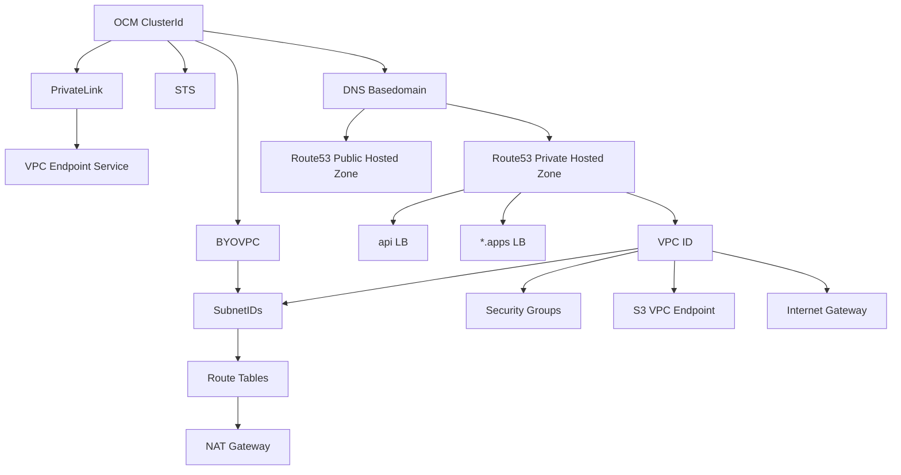

# mirrosa

Ever wondered if AWS infrastructure around a ROSA cluster has been modified? Wonder no more!
Given a cluster id, mirrosa will let you know if a ROSA cluster is truly the fairest of them all.

## Installation

```bash
go install github.com/mjlshen/mirrosa
```

or building from source

```bash
go build .
```

## Prerequisites

- Valid OCM session
- Active OCM backplane tunnel (`ocm backplane tunnel -D`)

## Usage

```bash
mirrosa -cluster-id "${CLUSTER_ID}"
```

## How it works

The goal of mirrosa is to essentially walk this graph to validate specific components of ROSA clusters. It collects information about a cluster from OCM and then uses ocm-backplane to build an AWS client in-memory to start validating!



Each AWS resource in the graph is represented by a `Component`, which requires functions to validate the component and return documentation if validation fails.

```go
// Component represents a specific component that will be validated
type Component interface {
	// FilterValue returns the name of the component to implement the github.com/charmbracelet/bubbles/list Item interface
	FilterValue() string

	// Documentation returns a short description of the component's expected configuration
	Documentation() string

	// Validate checks a component for any misconfiguration and returns any error
	Validate(ctx context.Context) error
}
```

## Future Work

- More in-depth validation of non-BYOVPC clusters, e.g. NAT Gateway, IGW, Subnet Route tables
- More in-depth validation of securitiy group rules
- A TUI UX for fun with charmbracelet, which can help users learn about ROSA clusters beyond just validating them
