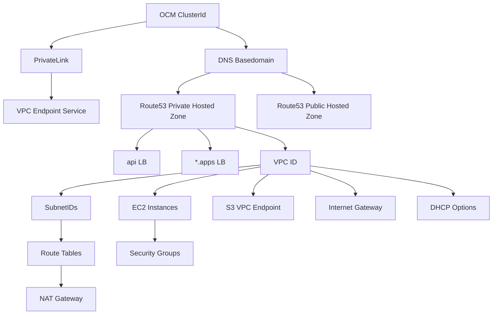

# mirrosa

Ever wondered if AWS infrastructure around a ROSA cluster has been modified? Wonder no more! `mirrosa` will let you know if a ROSA cluster is truly the fairest of them all.

## Installation

For Linux and macOS binaries see the [GitHub release assets](https://github.com/mjlshen/mirrosa/releases/latest).

Release binaries are signed using [cosign](https://github.com/sigstore/cosign) and can be verified like:

```bash
cosign verify-blob --key signing.pub --signature mirrosa_darwin_arm64.sig mirrosa_darwin_arm64
```

## Developer Installation

```bash
go install github.com/mjlshen/mirrosa@latest
```

## Prerequisites

- Valid OCM session
- [backplane-cli](https://github.com/openshift/backplane-cli) with the right configuration.

## Usage

Validate of a cluster's AWS configuration using a cluster's name, internal ID, or external ID:

```bash
mirrosa -cluster-id mshen-sts
```

## How it works

The goal of mirrosa is to essentially walk this graph to validate specific components of ROSA clusters. It collects information about a cluster from OCM and then uses ocm-backplane to build an AWS client in-memory to start validating! It's main purpose is to be a helpful learning and troubleshooting tool for SREs, so when adding features try to keep the [AWS permissions available](https://github.com/openshift/managed-cluster-config/blob/master/resources/sts/4.11/sts_support_permission_policy.json) for SREs into account.



Each AWS resource in the graph is represented by a `Component`, which requires functions to validate the component and return documentation if validation fails.

```go
// Component represents a specific component that will be validated
type Component interface {
	// FilterValue returns the name of the component to implement the github.com/charmbracelet/bubbles/list Item interface
	FilterValue() string

	// Documentation returns a thorough description of the component's expected configuration.
	// It should allow a new user of ROSA to understand what the expected state is and why it should be that way.
	Documentation() string

	// Validate checks a component for any misconfiguration and returns any error
	Validate(ctx context.Context) error
}
```

## Future Work

Check out the issues and [CONTRIBUTING.md](CONTRIBUTING.md)!

### Long Term

- A TUI UX for fun with charmbracelet, which can help users learn about ROSA clusters interactively beyond just validating them
