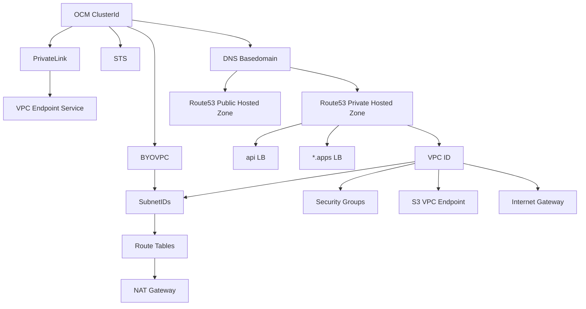

# mirrosa

* pkg/rosa
    * pkg/rosa/sts - Specific code for validating STS rosa clusters
    * pkg/rosa/byovpc - Specific code for validating BYOVPC clusters
    * pkg/rosa - Shared AWS code for all ROSA clusters

* main.go
    * Input: ClusterID
    * Figure out what type of ROSA cluster that clusterID is
    * Output: Validate and print any differences in AWS

